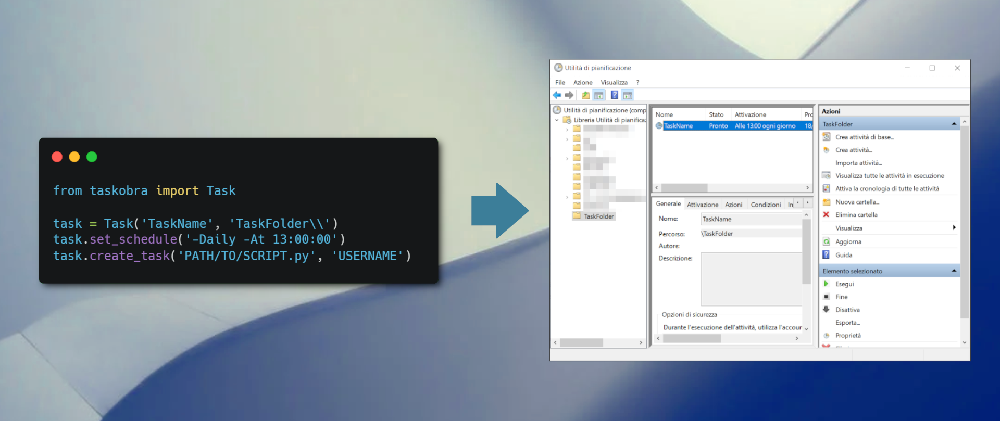

  
  
Taskobra is a lightweight and easy way to manage Windows schedules programmatically. Taskobra can also execute your code as a Windows service.  

It uses Powershell commands under the hood to create and delete tasks in the scheduler:  
```python
from taskobra import Task

task = Task('TaskName', 'TaskFolder\\')
task.set_schedule('-Daily -At 13:00:00')
task.delete_task() # DELETES THE TASK ONLY IF EXISTS
task.create_task('PATH/TO/SCRIPT.py', 'USERNAME') # WITH LOGGED IN USER 
task.create_task('PATH/TO/SCRIPT.py', 'USERNAME', 'PASSWORD')  # WITH OTHER USER
# ADDED IN v0.0.2 ###############
# Enable disable a task
task.disable_task()
task.enable_task()
# Start/Stop a Task
task.run_task()
task.stop_task()
# Last Run Info
task.get_last_run()
print(task.last_run)
```
As of v0.0.3 this package can also create and manage windows services (you'll need to download NSSM, check out the Installation paragraph):
```python
from taskobra import Service

service = Service("MyService")
service.create_service("PATH/TO/SCRIPT.py")
service.start_service()
```
# Tutorial
If you need some help you can find 2 tutorials here:  
Quickstart: https://medium.com/p/60dbd79add7b  
Windows Service: https://python.plainenglish.io/turn-your-python-code-into-a-windows-service-in-3-steps-a109193d5ecc

# Disclaimer
This package is a WIP and it's not meant to be used in production environments. **Use it at your own risk!**


# Installation
To install the library you'll need to run the following command in your terminal:
```
pip install git+https://github.com/Inzaniak/tasKobra@master
```

If you need to use the Windows Service functionalities you'll also need the following tool:  
https://nssm.cc/download

Extract the win64 directory on your drive and then add the path to your PATH environmental variables:
```powershell
$env:Path += ';C:\PATH_TO_win64_FOLDER'
```

---
## Supported Features (v0.0.3)
- Windows Scheduler
    - Task Creation
    - Task Deletion
    - Task Replacement
    - Schedule Edit
    - Task Enabling/Disabling
    - Task Running/Stopping
    - Get last task execution
- Windows Service
    - Service Creation
    - Service Deletion
    - Service Start/Stop/Restart
    - Check Service Status
---
## Made by Inzaniak
   

Personal Website: https://inzaniak.github.io 
 
If you'd like to support my work consider subscribing to medium with my referral: https://medium.com/@inzaniak/membership

If you don't want to activate a subscription plan, but you'd still like to support me consider buying my music from Bandcamp:  
https://inzaniak.bandcamp.com